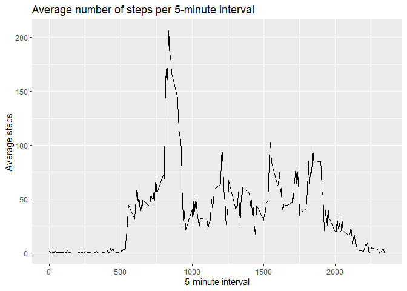

## Loading and preprocessing the data

```r
dat <- read.csv(file = unz(here('activity.zip'),
                           file = 'activity.csv')) %>% 
    mutate(date = as.Date(date))
```

## What is mean total number of steps taken per day?


```r
totalSteps <- dat %>% 
    na.omit() %>% 
    group_by(date) %>% 
    summarize(totalSteps = sum(steps))

ggplot(totalSteps, aes(totalSteps)) +
    geom_histogram() +
    labs(title = 'Histogram of total number of steps taken per day',
         x = 'Total number of steps per day',
         y = '')
```

<!-- -->

```r
mymean <- totalSteps %>% 
    summarize(meanSteps = mean(totalSteps),
              medianSteps = median(totalSteps))

# as.character necessary to simplify formatting of inline code output. Otherwise we get scientific format and googling to format inline R knitr numerical output was not successful.
meanSteps <- as.character(round(mymean$meanSteps, 0))
medianSteps <- as.character(round(mymean$medianSteps, 0))
```

The mean steps taken per day is 10766.   
The median steps taken per day is 10765.

## What is the average daily activity pattern?


```r
avInt <- dat %>%
    na.omit() %>% 
    group_by(interval) %>%
    summarize(aveSteps = mean(steps))

ggplot(avInt, aes(interval, aveSteps)) +
  geom_line() +
  labs(title = 'Average number of steps per 5-minute interval',
       x = '5-minute interval',
       y = 'Average steps')
```

<!-- -->

```r
maxSteps <- avInt$interval[avInt$aveSteps == max(avInt$aveSteps)]
```
The maximum number of steps in the 5-minute average intervals was the interval 835

## Imputing missing values


```r
totalNA <- sum(is.na(dat$steps))
```

There are 2304 missing values in the dataset.
 

```r
# Fill missing values with the average 5-min steps and find daily total steps
datMiss <- full_join(dat, avInt, by = 'interval') %>% 
  mutate(steps = ifelse(is.na(steps), aveSteps, steps)) %>% 
  group_by(date) %>% 
  summarize(totalSteps = sum(steps))
```


```r
ggplot(datMiss, aes(totalSteps)) +
  geom_histogram() +
  labs(title = 'Histogram of total number of steps taken per day',
       x = 'Total number of steps per day',
       y = '')
```

<!-- -->

```r
meanStepsF <- as.character(round(mean(datMiss$totalSteps, 0)))
medianStepsF <- as.character(round(median(datMiss$totalSteps, 0)))
```

The mean steps taken per day is 10766 in the filled data set. This represents a difference of 0 steps in the filled data set.      
The median steps taken per day is 10766 in the filled data set. This is a difference of 1 steps in the filled data set.


## Are there differences in activity patterns between weekdays and weekends?


```r
datAll <- full_join(dat, avInt, by = 'interval') %>% 
  mutate(steps = ifelse(is.na(steps), aveSteps, steps),
         day = weekdays(date, abbreviate = T))

datAll <- datAll %>% 
  mutate(isweekend = ifelse(day %in% c('Sat', 'Sun'), 'Weekend', 'Weekday')) %>%
  mutate(isweekend = factor(isweekend)) %>% 
  select(-aveSteps, -day) %>% 
  group_by(isweekend, interval) %>% 
  summarize(aveSteps = mean(steps))

ggplot(datAll, aes(interval, aveSteps)) +
  geom_line() +
  facet_wrap(~isweekend, dir = 'v') +
  labs(title = 'Step comparison of weekdays vs weekends',
       x = '5-minute time interval',
       y = 'Average number of steps')
```

<!-- -->
